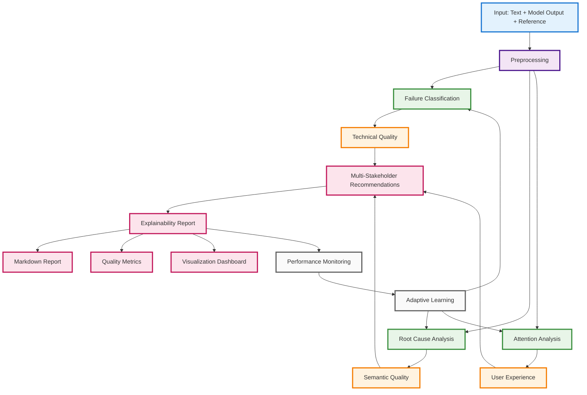
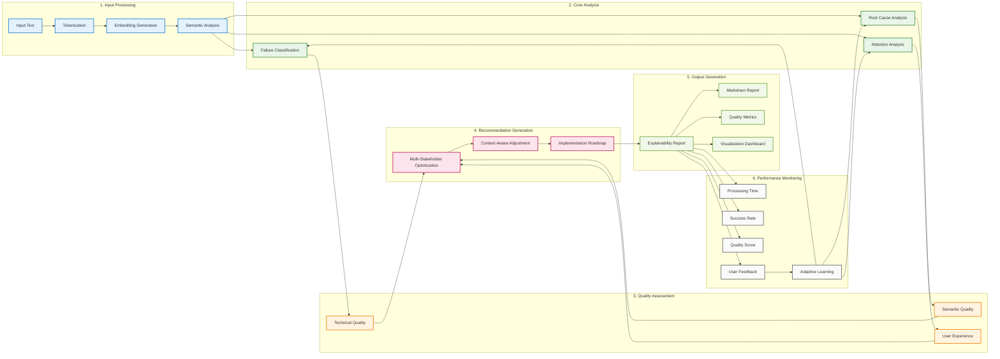
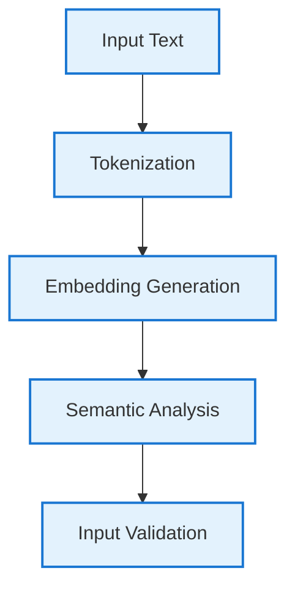
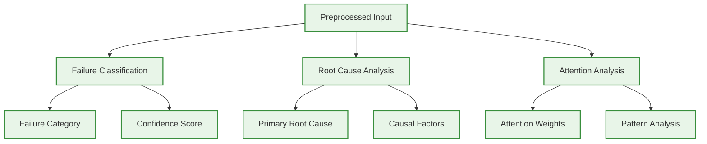
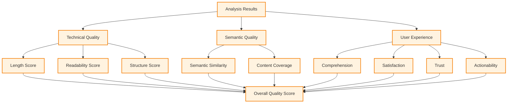
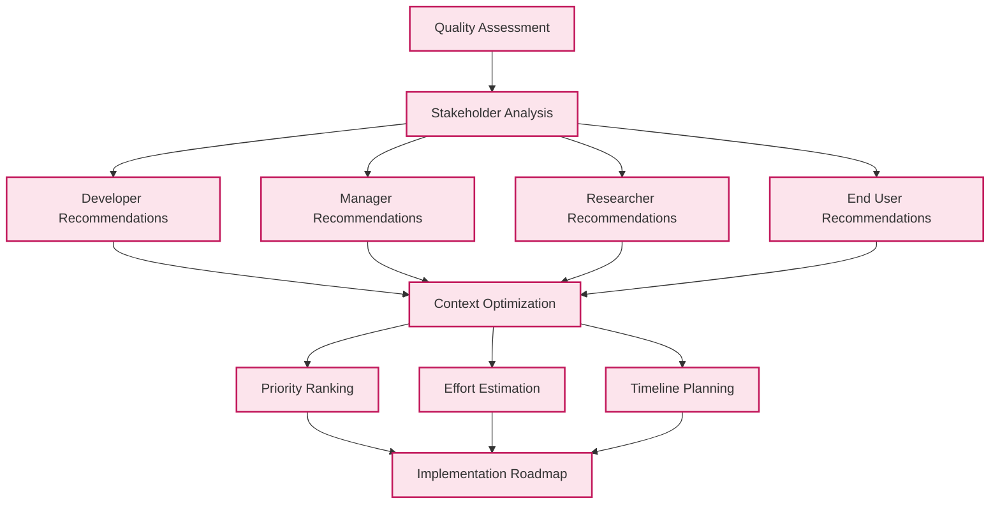
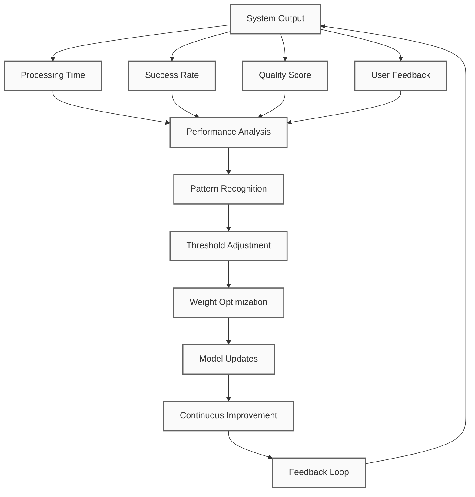

# LLM Explainability Framework: Simplified Workflow

## Main Workflow Overview

## Detailed Process Flow

## Key Components Breakdown

### 🔍 **Input Processing**

### 🧠 **Core Analysis**

### 📊 **Quality Assessment**

### 🎯 **Recommendation Engine**

### 📈 **Performance Monitoring**

## Key Features Summary

### 🔄 **End-to-End Processing**
1. **Input Processing**: Text tokenization, embedding generation, semantic analysis
2. **Core Analysis**: Failure classification, root cause analysis, attention analysis
3. **Quality Assessment**: Technical, semantic, and user experience metrics
4. **Recommendation Generation**: Multi-stakeholder optimization with context awareness
5. **Output Generation**: Comprehensive reports with visualizations
6. **Performance Monitoring**: Real-time tracking with adaptive learning

### 🎯 **Key Innovations**
- **Multi-modal attention analysis** with cross-attention computation
- **Ensemble decision making** combining semantic and LLM-based classification
- **Context-aware optimization** for different stakeholder needs
- **Real-time performance monitoring** with continuous improvement
- **Robust error handling** with fallback mechanisms

### 📊 **Quality Assurance**
- **Multi-dimensional evaluation** covering technical, semantic, and user aspects
- **Weighted quality scoring** with adaptive thresholds
- **Confidence assessment** across all analysis components
- **Stakeholder-specific optimization** for practical utility

### 🔧 **Technical Robustness**
- **Numerical stability** in attention computation
- **NaN handling** with comprehensive error recovery
- **Fallback mechanisms** for edge cases
- **Performance optimization** with caching and parallel processing

This workflow provides a comprehensive, robust, and adaptive framework for LLM explainability that addresses both theoretical accuracy and practical utility requirements. 